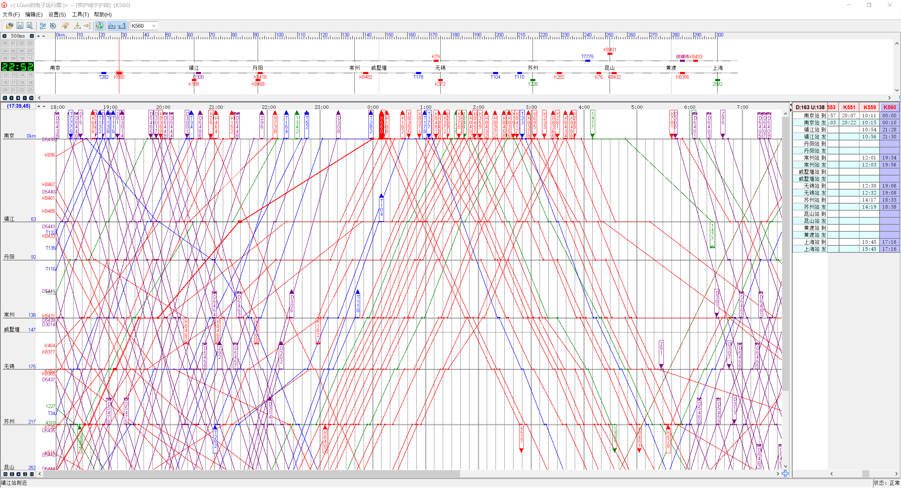

# Team 1 Project 3 Week 5 Report

Participants:  Ziqi Gao, Tiansu Chen, Chenyang Zhang

Meeting Date:  2021. 3. 26

Project Leader: Ziqi Gao

## Summary

Things finished since last meeting : Further understand the requirement. Solved part of problems asked in last week.

Ziqi Gao: Search for information about China railway. Reconsider requirement.

Tiansu Chen: collaborate with S1.

Chenyang Zhang: collaborate with S1.

## Questions prepared for the instructor team

Q1:  What is the input? Does the schedule contain the arrival time and departure time all stations for all locomotives? If so, what is the layout? The picture below is a layout that is assumed to be given by the user, but it actually contains schedule.

Still need to be checked but UI part is the most important part in this project from my current point of view.

Q2: What does the automated control algorithm mean? Do we need to write a time scheduling algorithm using algorithms including dynamic programming and greedy?  Or do we only need to check  collision, delay time, and whether all locomotives reach destinations or not instead of coming up with such algorithm?

Result: Understand partly now. TA team didn't give us an exact feedback on this question, actually. But I don't really think that this is a reasonable requirement for an undergraduate course that aims at helping us learn how to get a product done from requirement to validation - this will overburden student with hard time scheduling algorithms and let student spend too much time on the algorithm part.

Q3: What is the command sent by the user? Does the user give us the time scheduling algorithm and we only need to visualize and check collision, delay time, and whether all locomotives reach destinations or not? Or, the command is a change in the environment, for example, a train is broken and need more time to repair. This means that we need to come up with a dynamic time scheduling algorithm.

Result: still need to be checked further.

## Action Items (Plan for the next week):

Ziqi Gao:  Try to draw UML.

Tiansu Chen:  Discuss and collaborate with Ziqi

Chenyang Zhang:  Discuss and collaborate with Ziqi

Other random staff for memorization:

1. infinite trains at a station
2. only stop at station
3. assume only 0 - max speed first
4. 优先级规定, 3 Speed, GDK
5. + environment factor
6. 调度的内容：停留 + 速度

INPUT: 起点终点是否相同，每个站的到达和出发时间是否给定，Manually send command?

